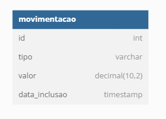

Projeto Fluxo de Caixa.
Arquiteto de soluções - PLENO

1.	Necessidade de negócio
Um comerciante precisa controlar o seu fluxo de caixa diário com os lançamentos (débitos e créditos), também precisa de um relatório que disponibilize o saldo diário consolidado.
•	Requisitos de Negócio:
•	Serviço que faça o controle de lançamentos
•	Serviço do consolidado diário

2.	Diagramas de Modelagem de Dados e Arquitetura
 
Para atender os requisitos inciais do projetos vamos utilizar apenas a tabela movimentação.
Essa tabela ficará encarregada de guardar as informações de entrada e saída do fluxo de caixa.
Incialmente dentro dessa aplicação vamos utilizar um banco de dados SQLite, trata-se de um banco de dados compacto, leve e de fácil manutenção.
Podemos realizar uma migração para um banco de dados em MariaDB dentro de um servidor AWS.

3.	Arquitetura resumida
Baseando em uma solução simples, precisamos iniciar o servidor de API que podemos hospedar em um servidor AWS, o servidor de API será o script app.py, com a aplicação iniciada devemos enviar um post com os dados de entrada. A URL de entrada será http://127.0.0.1:5000/movimentacao
{
"tipo": "saida",
"valor": 100
}
Com o servidor iniciado podemos realizar os testes da aplicação utilizando qualquer ferramenta de integração de API, como exemplo vamos utilizar o postman para realizar a chamada da api.
 

No exemplo acima utilizamos o post para enviar os dados de entrada.
O tipo sempre será utilizado como padrão os tipos. ENTRADA, SAIDA.
O valor será permitido apenas valores do tipo inteiro e somente valores positivos.

Vamos utilizar o script cliente.py para realizar a integração com o usuário.
Ao executar o script ele irá pedir o tipo da entrada que deverá ser ENTRADA OU SAIDA.
Após será solicitado o valor que sempre será um numero inteiro e maior que 0. Numero negativos não serão permitidos.
Após a entrada dos dados será feita a requisição da API para gravar os dados no banco de dados.
O usuário será perguntado será ele desejar inserir novos dados, caso a resposta seja sim o processo será reiniciado.
Caso a resposta seja não o processo será encerrado.
4.	PONTOS POSITIVOS DA APLICACAO.
Utilizando o serviço de API em um servidor WEB é possível realizar o input dos dados vindo de varias aplicações simultâneas.
Velocidade na integração dos dados
Serviço de API é seguro e de fácil instalação.
Serviço do cliente é independente podendo ser instalado em diversas maquinas para utilização.
 

5.	Serviço Consolidado
A consolidação dos dados de entrada salvo no banco será realizada através de um dashboard em power bi.
O power BI esta programado e conectado ao banco de dados SQLite, ele irá calcular os dados do balanço total, todas as entradas, todas as saídas, visualização dos dados por dia, e total de registros inseridos no banco de dados
 

Ao passar o mouse por sobre o gráfico é possível ver os detalhes da movimentação
 

O banco de dados esta localizado dentro da aplicação.
Para conectar o power BI ao SQLite é necessário o auxilio da ferramenta OBDC drive que é acessível através do link. http://www.ch-werner.de/sqliteodbc/

após baixar e instalar a ferramenta devemos criar a conexão OBDC. Ao abrir a ferramenta devemos clicar no botão Adicionar
 

Será aberto uma tela com todos os drivers que estão acessíveis dentro do servidor local. Devemos selecionar a opção SQLite3. 
 
Devemos dar o nome a conexão e no campo DATABASE Name, devemos selecionar nosso arquivo do SQLite. Apos clicar em OK. O pronto a nossa conexão OBDC esta feita e podemos interagir com o power bi.
Para criar a interação do power bi com o OBDC drive devemos abrir o power bi e realizar a conexão. Para o nosso projeto em questão devemos abrir o projeto e selecionar a opção no menu superior TRANSFORMAR DADOS. Assim teremos acesso ao PowerQuery do powerBI.
 
Dentro do power Query teremos uma visão geral dos dados importados do SQLite, precisamos ajustar nossa fonte de dados devido a mudança de pasta. Entao clicamos no menu lateral direito, na opção FONTE, para editar a fonte de dados.
 
Assim será aberto a opção de Conexao OBDC. Devemos selecionar a opção de conexão que acabamos de configurar.
 
Após essa configuração podemos fechar o power query e atualizar os dados do power bi.
Pronto nosso relatório será atualizado com os dados da aplicação e será exibido os dados de entrada do fluxo de caixa.

PROJETO
FLUXO DE CAIXA.
Padrão de arquitetura.
Python utilizando o Flask para utilização da API, banco de dados em SQLite, relatório de consolidação em POWERBI.

Arquiteto
Thiago Santos
Link github: https://github.com/thiagofcsantos/Fluxodecaixa
